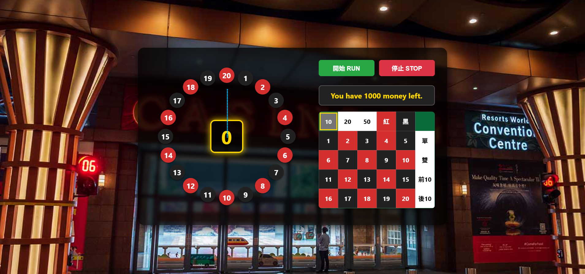
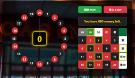

# Interactive Roulette Web Game (賭盤小遊戲系統)

[](https://developer.mozilla.org/en-US/docs/Web/JavaScript)
[](https://developer.mozilla.org/en-US/docs/Web/HTML)
[](https://developer.mozilla.org/en-US/docs/Web/CSS)

A responsive, interactive European-style roulette game developed using pure vanilla **HTML5, CSS3, and JavaScript**. The project demonstrates dynamic DOM manipulation, trigonometric coordinate calculations for wheel rendering, timer-driven spin physics, and a modular betting state machine without external UI frameworks.

---

## 🚀 Key Features & Implementation Details

* **Dynamic Trigonometric Wheel Rendering**:
  * Calculates sector angles and label coordinates mathematically using trigonometric functions ($\sin$, $\cos$), dynamically populating the wheel elements directly into the DOM.
* **Spin Physics & Deceleration Mechanics**:
  * Utilizes JavaScript timer intervals (`requestAnimationFrame` / `setInterval`) to simulate realistic rotational acceleration, deceleration, and randomized winning pocket determination.
* **Betting & Chip State Management**:
  * Supports real-time balance tracking, multi-denomination chip placement, payout calculation based on roulette odds, and transactional undo/clear actions.
* **Event-Driven Architecture**:
  * Modular event handlers manage start, spin, reset, and betting listeners to ensure UI synchronization and state consistency.

---

## 🎮 Showcase & User Interface

| Roulette Wheel & Main Interface | Betting Board & Chip Selection |
| :---: | :---: |
|  |  |

---

## 🛠️ Tech Stack

* **Front-End**: HTML5, CSS3 (Flexbox/Grid, Animations), Vanilla JavaScript (ES6+)
* **Core Concepts**: Trigonometric Layouts, DOM Manipulation, State Machine, Timer Controls

---

## 📂 Project Structure

```text
├── assets/                  # UI snapshots and gameplay screenshots
│   ├── roulette_main_ui.png
│   └── roulette_betting_ui.png
├── index.html               # Game structure and layout
├── style.css                # Visual presentation and wheel styling
├── script.js                # Core game logic, odds computation, and animation
└── README.md
🚦 How to Run Locally
Clone this repository:

Bash
git clone [https://github.com/Jimmy0330/interactive-roulette-game.git](https://github.com/Jimmy0330/interactive-roulette-game.git)
Navigate to the project directory:

Bash
cd interactive-roulette-game
Open index.html in any modern web browser directly (no local server required).


